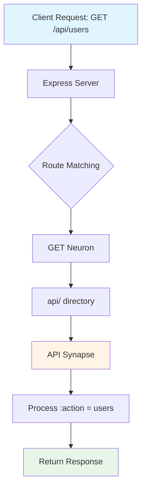

# Welcome to BEnder! 🧠

**BEnder** is a TypeScript-based Express boilerplate featuring a brain-inspired architecture for rapid backend development. It uses a unique **Neuron/Synapse** pattern that enables intuitive, file-system-based routing.

---

## 🚀 Quick Start

### Installation

```bash
# Install dependencies
npm install

# Start development server (with hot-reload)
npm run server
```

The server will start on the port specified in your `.env` file (default: 3000).

---

## 🏗️ Architecture Overview

BEnder organizes routes using a **brain-inspired metaphor**:

- **Neurons** 🧠 - Container classes that automatically discover and organize routes
- **Synapses** ⚡ - Endpoint handlers that process HTTP requests

### Reserved Prefixes

Files and directories prefixed with `_` (underscore) are **ignored** by the route discovery system:

| Pattern | Purpose |
|---------|---------|
| `_errors.json` | Auto-generated error logs from `tryer()` |
| `_helpers.ts` | Private utilities not exposed as routes |
| `_internal/` | Internal directories excluded from routing |

This allows you to co-locate helper code and logs alongside your Synapses without them being treated as route modules.

### How Routing Works

Routes are automatically constructed from the **file system structure**:

```
methods/GET/              ← HTTP method (Neuron)
  ├── api/                ← Path segment: /api
  │   └── API.ts          ← Synapse handles: GET /api/:action
  └── db/                 ← Path segment: /db
      └── DB.ts           ← Synapse handles: GET /db/:action
```

**Result**: `GET /api/users` automatically routes to `methods/GET/api/API.ts`



---

## 📁 Project Structure

```
BEnder/
├── app.ts                    # Entry point - registers HTTP method routers
├── app.config.ts             # Centralized app configuration
├── .env                      # Environment variables (create from template)
├── tsconfig.json             # TypeScript configuration
│
├── config/                   # Configuration layer
│   ├── infrastructure.ts     # Express + middleware setup
│   ├── keys.ts               # Environment variable management
│   └── interfaces/           # TypeScript type definitions
│
├── methods/                  # HTTP method handlers (Neurons)
│   ├── base.ts              # Neuron & Synapse base classes ⭐
│   ├── GET/                 # GET requests
│   │   ├── GET.ts           # GET Neuron
│   │   ├── api/API.ts       # Example: GET /api/:action
│   │   └── db/DB.ts         # Example: GET /db/:action
│   ├── POST/                # POST requests
│   ├── PUT/                 # PUT requests
│   └── ...                  # DELETE, PATCH, HEAD, OPTIONS
│
├── apps/                     # Business logic (your application code)
│   ├── core/                # Shared utilities
│   └── demo/                # Example application
│
└── public/                   # Static files
```

---

## 🧠 Understanding Neurons & Synapses

### Synapse (Base Class)

A **Synapse** is an endpoint handler that processes requests:

```typescript
import { Synapse } from '../base';
import { Request, Response } from 'express';

export class MyEndpoint extends Synapse {
    dir = __dirname;  // Required: current directory
    
    protected setRouter(): void {
        // Define your routes here
        this.router.get('/hello', (req: Request, res: Response) => {
            res.json({ message: 'Hello World!' });
        });
    }
}
```

**Features:**
- `tryer<T>()` - Async error wrapper with automatic logging
- `responser()` - Standardized response formatting
- Built-in error message mapping (400-504 codes)

### Neuron (Base Class)

A **Neuron** automatically discovers and mounts child Synapses:

```typescript
import { Neuron } from '../base';

export class GET extends Neuron {
    dir = __dirname;  // Scans this directory for subdirectories
}
```

**Magic:** Neurons automatically:
1. Scan `dir` for subdirectories
2. Import TypeScript modules from each subdirectory
3. Mount exported Synapses as routers

---

## ⚙️ Configuration

### Environment Variables

Create a `.env` file in the project root:

```env
PORT=3000
NODE_ENV=development

# Database (optional - see database setup)
DB_TYPE=sql
DB_HOST=localhost
DB_PORT=5432
DB_NAME=myapp
DB_USER=postgres
DB_PASSWORD=secret
```

All environment variables are validated and typed in [`config/keys.ts`](file:///d:/Main%20Vein/Unknown/MyDevs/Libraries/BEnder/config/keys.ts).

### Application Config

Modify [`app.config.ts`](file:///d:/Main%20Vein/Unknown/MyDevs/Libraries/BEnder/app.config.ts) to configure:

- **CORS**: Allowed origins, methods, headers
- **Rate Limiting**: Request throttling rules
- **Security**: Helmet CSP directives
- **Database**: Connection settings (see below)

---

## 🗄️ Database Setup

BEnder supports **7 database categories** with generic scaffolding:

| Type | Examples | Use Case |
|------|----------|----------|
| `sql` | PostgreSQL, MySQL, MS SQL | Relational data |
| `nosql` | MongoDB, Cassandra | Flexible schemas |
| `keyvalue` | Redis, Memcached | Caching, sessions |
| `document` | MongoDB, CouchDB | JSON documents |
| `graph` | Neo4j, Neptune | Relationship-heavy data |
| `timeseries` | InfluxDB, TimescaleDB | Time-stamped data |
| `cloud` | AWS RDS, Google Cloud SQL | Managed cloud DBs |

### Setup Steps

1. **Configure in `app.config.ts`**:
   ```typescript
   export const appConfig: AppConfig = {
       db: {
           type: 'sql',
           sql: {
               type: 'postgres',
               host: 'localhost',
               port: 5432,
               username: 'user',
               password: 'pass',
               database: 'mydb'
           }
       },
       // ... other config
   };
   ```

2. **Add environment variables** to `.env`:
   ```env
   DB_TYPE=sql
   DB_HOST=localhost
   DB_PORT=5432
   ```

3. **Install database driver** (example for PostgreSQL):
   ```bash
   npm install pg
   ```

4. **Implement connection logic** in [`config/infrastructure.ts`](file:///d:/Main%20Vein/Unknown/MyDevs/Libraries/BEnder/config/infrastructure.ts)
   (See scaffolding comments for guidance)

---

## 🛡️ Security Features

BEnder comes pre-configured with:

- ✅ **Helmet** - Security headers (CSP, XSS protection)
- ✅ **CORS** - Cross-origin request control
- ✅ **Rate Limiting** - 100 requests per 15 minutes (configurable)
- ✅ **Cookie Parser** - Secure cookie handling
- ✅ **Morgan** - HTTP request logging

All security settings are centralized in [`app.config.ts`](file:///d:/Main%20Vein/Unknown/MyDevs/Libraries/BEnder/app.config.ts).

---

## 🧪 Development

### TypeScript Compilation

```bash
# Check for TypeScript errors
npx tsc --noEmit
```

### Hot Reload

The `npm run server` command uses **nodemon** for automatic restarts on file changes.

---

## 📝 Creating New Routes

### Example: Add `POST /users/create`

1. **Navigate to** `methods/POST/users/`
   ```bash
   mkdir -p methods/POST/users
   ```

2. **Create** `methods/POST/users/Users.ts`:
   ```typescript
   import { Synapse } from '../../base';
   import { Request, Response } from 'express';

   export class POST_Users extends Synapse {
       dir = __dirname;
       
       protected setRouter(): void {
           this.router.post('/create', async (req: Request, res: Response) => {
               const { code, data } = await this.tryer(async () => {
                   // Your business logic here
                   return { userId: 123, name: req.body.name };
               });
               
               this.responser(res, code, data);
           });
       }
   }
   ```

3. **Done!** The route `POST /users/create` is now available.

---

## 🤝 Contributing

BEnder is designed for extensibility. Feel free to:
- Add custom middleware in `infrastructure.ts`
- Create reusable Synapses in `apps/core/`
- Extend the base classes for custom behavior

---

## 📚 Additional Resources

- [Express.js Documentation](https://expressjs.com/)
- [TypeScript Handbook](https://www.typescriptlang.org/docs/)
- [Helmet Security](https://helmetjs.github.io/)

---

**Built with ❤️ for rapid backend development**